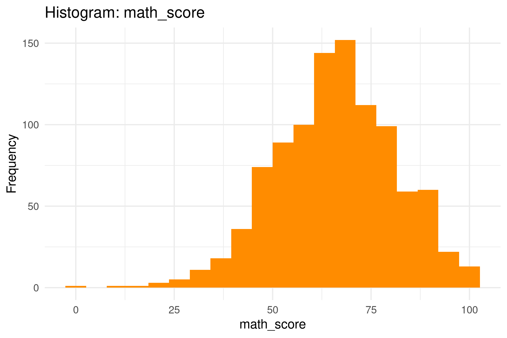
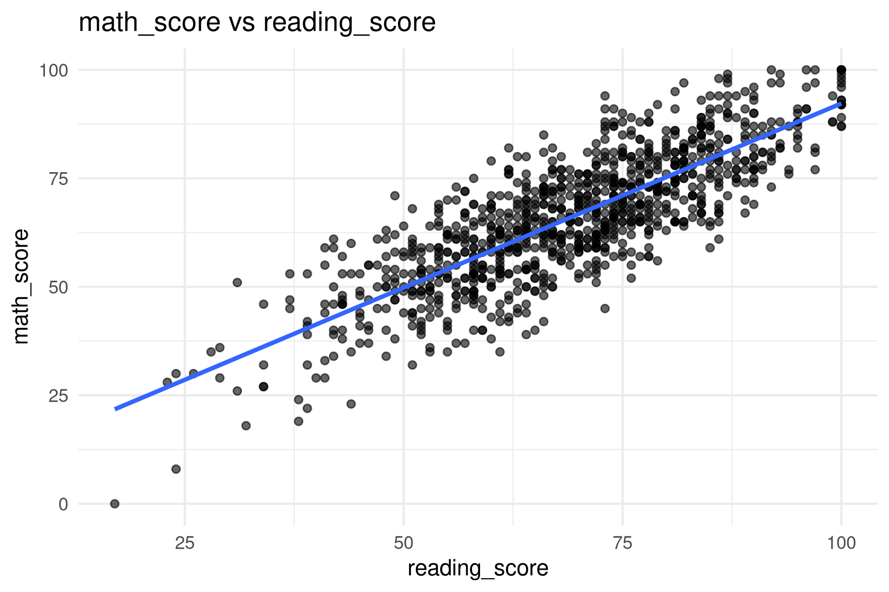
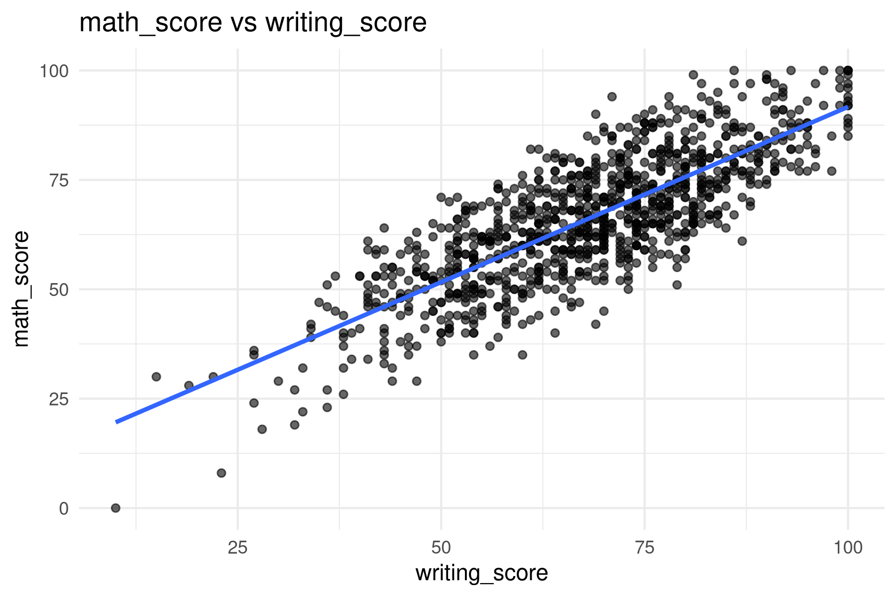
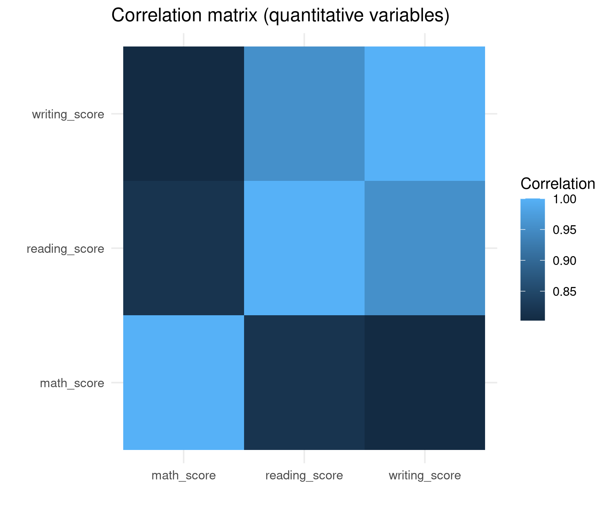
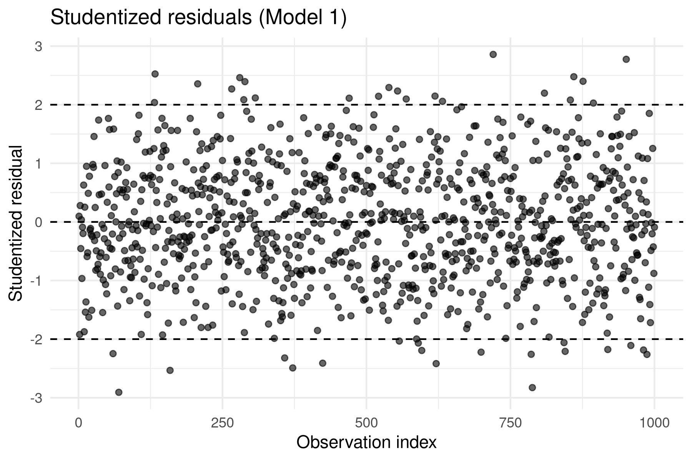

# Déterminants des performances en mathématiques des élèves et reproduction sociale.

**Cours :** Introduction à la Data Science – IMT-BS  
**Groupe :**  
- ADROVER Killian  
- LAVAUD Lisa  
- LAVESNES Tao  

---

## 1. Introduction

La performance scolaire constitue un enjeu central en économie de l’éducation, dans la mesure où elle conditionne à la fois les trajectoires individuelles des élèves et, à plus long terme, la formation du capital humain d’une économie. De nombreux travaux ont montré que la réussite académique ne dépend pas uniquement des capacités individuelles, mais s’inscrit dans un cadre plus large marqué par les inégalités sociales, l’environnement familial et les conditions socio-économiques. Dans cette perspective, l’école joue un rôle ambivalent : elle peut être un vecteur de mobilité sociale, mais également un mécanisme de reproduction des inégalités existantes.

Les performances en mathématiques occupent une place particulière dans ce débat. Elles sont souvent considérées comme un indicateur clé des compétences académiques générales et sont fortement corrélées aux trajectoires scolaires ultérieures, notamment dans les filières scientifiques et techniques. Comprendre les déterminants de la réussite en mathématiques permet ainsi d’éclairer les mécanismes par lesquels les inégalités sociales et éducatives se traduisent en différences de performances observables dès le secondaire.

L’objectif de cette étude est d’identifier les principaux facteurs associés aux performances en mathématiques des élèves. Plus précisément, nous cherchons à analyser dans quelle mesure les compétences académiques transversales (lecture et écriture), l’environnement familial — appréhendé à travers le niveau d’éducation des parents —, le contexte socio-économique, ainsi que les comportements d’investissement scolaire, tels que la participation à un cours de préparation aux examens, influencent le score obtenu en mathématiques. L’hypothèse centrale est que ces différents facteurs jouent un rôle significatif et cumulatif dans la réussite scolaire, contribuant potentiellement à la reproduction des inégalités éducatives.

Pour répondre à cette question, nous mobilisons le jeu de données *Students Performance in Exams*, qui regroupe des informations individuelles sur 1 000 élèves. La variable expliquée est le score en mathématiques, tandis que les variables explicatives incluent les scores en lecture et en écriture, le niveau d’éducation des parents, le type de déjeuner — utilisé comme indicateur du statut socio-économique — et la participation à un cours de préparation aux examens. L’analyse repose sur l’estimation d’un modèle de régression linéaire par la méthode des moindres carrés ordinaires, adaptée à la nature continue de la variable expliquée.

Les résultats obtenus montrent que les compétences en lecture et en écriture sont fortement et positivement associées aux performances en mathématiques. Les variables liées à l’environnement familial et socio-économique apparaissent également comme des déterminants importants, tout comme la préparation aux examens. Dans l’ensemble, le modèle explique une part substantielle de la variabilité des scores en mathématiques, ce qui confirme l’importance conjointe des compétences individuelles, de l’origine sociale et des comportements d’investissement scolaire dans la réussite académique.

---

## 2. Hypothèses et articles

De nombreux travaux en économie de l’éducation analysent les déterminants des performances scolaires des élèves, en mettant l’accent sur le rôle de l’environnement familial, des compétences académiques et du contexte socio-économique. Cette section présente trois articles de référence traitant de problématiques proches de celle étudiée dans ce travail.

Coleman et al. (1966) proposent l’une des premières analyses empiriques à grande échelle des déterminants de la réussite scolaire aux États-Unis. À partir de données administratives et d’enquêtes portant sur plusieurs centaines de milliers d’élèves, les auteurs estiment différents modèles de régression linéaire reliant les performances scolaires à des caractéristiques individuelles, familiales et scolaires. Leurs résultats montrent que l’environnement familial, et notamment le niveau d’éducation des parents, joue un rôle déterminant dans les performances académiques, parfois plus important que les caractéristiques propres aux établissements scolaires. Cette étude met ainsi en évidence des mécanismes de reproduction sociale à l’œuvre dès le secondaire.

Hanushek et Woessmann (2011) s’intéressent aux déterminants des performances scolaires dans un cadre international, en mobilisant des données issues de tests standardisés (PISA, TIMSS). À l’aide de modèles de régression linéaire et de comparaisons entre pays, les auteurs montrent que les compétences cognitives mesurées par les scores en mathématiques, lecture et sciences sont fortement corrélées entre elles et constituent un facteur clé de la réussite éducative et économique à long terme. Leurs résultats suggèrent l’existence de compétences académiques transversales influençant l’ensemble des performances scolaires.

Enfin, plusieurs études empiriques plus récentes utilisent des indicateurs socio-économiques simples pour analyser les performances scolaires. Dans ce cadre, le type de déjeuner est fréquemment utilisé comme proxy du statut socio-économique des élèves. Ces travaux, basés sur des régressions linéaires, montrent que les élèves bénéficiant de repas subventionnés obtiennent en moyenne des résultats inférieurs à ceux bénéficiant de repas standards, traduisant l’impact des conditions économiques sur la réussite scolaire. Par ailleurs, la participation à des cours de préparation aux examens apparaît généralement associée à de meilleures performances, soulignant l’importance de l’investissement individuel dans le processus d’apprentissage.

Le présent travail s’inscrit dans la continuité de cette littérature, tout en se distinguant par l’utilisation d’un jeu de données individuel de taille modérée (1 000 observations) et par une focalisation explicite sur les performances en mathématiques. Contrairement aux études internationales ou institutionnelles, l’analyse repose sur un cadre économétrique simple et reproductible, adapté à un objectif pédagogique. Elle permet néanmoins de tester empiriquement, dans un cadre appliqué, les principaux mécanismes mis en évidence par la littérature existante.

Sur la base de ces travaux, nous formulons les hypothèses suivantes :
- **H1** : Les scores en lecture et en écriture ont un effet positif sur le score en mathématiques.  
- **H2** : Un niveau d’éducation plus élevé des parents est associé à de meilleures performances en mathématiques.  
- **H3** : Les élèves bénéficiant d’un déjeuner standard obtiennent de meilleurs scores en mathématiques que ceux bénéficiant d’un déjeuner subventionné.  
- **H4** : La participation à un cours de préparation aux examens a un effet positif sur le score en mathématiques.

---

## 3. Les données

### 3.1 Présentation générale du jeu de données

Les données utilisées dans cette étude proviennent du jeu de données *Students Performance in Exams*, mis à disposition sur la plateforme Kaggle. Ce jeu de données rassemble des informations individuelles relatives aux performances scolaires et au contexte socio-éducatif de 1 000 élèves. Les données sont issues d’un questionnaire administré aux élèves et de scores obtenus à des examens standardisés, ce qui permet de combiner des mesures objectives de performance académique avec des informations déclaratives sur l’environnement familial et les conditions socio-économiques.

L’ensemble des observations est complet pour les variables retenues dans l’analyse et ne présente pas de valeurs manquantes. Afin de garantir la cohérence de l’analyse économétrique, seules les variables mobilisées dans le modèle final ont été conservées dans la base de données traitée.

---

### 3.2 Statistiques descriptives

Les statistiques descriptives montrent que les scores en mathématiques, en lecture et en écriture sont compris entre 0 et 100, ce qui correspond à l’échelle de notation des examens. Les scores moyens sont relativement proches entre les trois disciplines, bien que l’on observe une dispersion non négligeable, traduisant une hétérogénéité des performances académiques entre les élèves.

Les variables qualitatives indiquent une diversité des situations familiales et socio-économiques. Le niveau d’éducation des parents est réparti entre six catégories, allant de « some high school » à « master’s degree ». Le type de déjeuner est utilisé comme indicateur du statut socio-économique, les élèves bénéficiant d’un déjeuner subventionné étant supposés provenir de ménages plus modestes. Enfin, une part significative des élèves déclare avoir suivi un cours de préparation aux examens.

Les tableaux et graphiques de statistiques descriptives détaillées sont présentés en annexe.

---

### 3.3 Description des variables

Le tableau ci-dessous présente l’ensemble des variables utilisées dans l’analyse, leur définition, leur nature, ainsi que le signe attendu de leur effet sur le score en mathématiques.

| Variable | Définition de la variable | Nature / mode de collecte | Effet attendu | Nombre d’observations |
|--------|---------------------------|---------------------------|---------------|----------------------|
| **Variable expliquée** |  |  |  |  |
| math_score | Score obtenu à l’examen de mathématiques (entre 0 et 100) | Variable quantitative continue, issue d’un test standardisé | — | 1 000 |
| **Variables explicatives** |  |  |  |  |
| reading_score | Score obtenu à l’examen de lecture (entre 0 et 100) | Variable quantitative continue, issue d’un test standardisé | Positif | 1 000 |
| writing_score | Score obtenu à l’examen d’écriture (entre 0 et 100) | Variable quantitative continue, issue d’un test standardisé | Positif | 1 000 |
| parental_level_of_education | Niveau d’éducation le plus élevé atteint par les parents | Variable qualitative catégorielle, issue d’un questionnaire | Positif | 1 000 |
| lunch | Type de déjeuner de l’élève (standard ou subventionné) | Variable binaire, proxy du statut socio-économique | Positif pour « standard » | 1 000 |
| test_preparation_course | Participation à un cours de préparation aux examens | Variable binaire, issue d’un questionnaire | Positif | 1 000 |

---

### 3.4 Qualité des données et limites

Les variables de performance académique sont mesurées de manière objective à partir de résultats d’examens standardisés, ce qui garantit une bonne fiabilité des mesures. En revanche, certaines variables explicatives, telles que le niveau d’éducation des parents ou la participation à un cours de préparation, sont déclaratives et peuvent être sujettes à des biais de déclaration.

Par ailleurs, certaines variables susceptibles d’influencer les performances scolaires, comme les aptitudes individuelles non observées ou la qualité des établissements scolaires, ne sont pas disponibles dans la base de données. Ces éléments constituent des sources potentielles d’endogénéité et sont capturés par le terme d’erreur du modèle.

---

## 4. Statistiques descriptives

Cette section présente les statistiques descriptives des variables utilisées dans l’analyse.  
L’objectif est double : d’une part, fournir une vue d’ensemble des caractéristiques principales des données, et d’autre part, vérifier l’absence de valeurs incohérentes ou illogiques susceptibles d’affecter la qualité de l’analyse économétrique.

Les statistiques descriptives complètes sont reportées dans le tableau ci-dessous. Elles incluent, pour chaque variable, la moyenne, l’écart-type, les valeurs minimale et maximale, la médiane, ainsi que des indicateurs de forme de la distribution (asymétrie et kurtosis) pour les variables quantitatives. Le nombre d’observations est identique pour l’ensemble des variables et s’élève à 1 000.

### Tableau 1 – Statistiques descriptives des variables

Le tableau suivant présente les statistiques descriptives pour l’ensemble des variables utilisées dans le modèle, qu’elles soient expliquée ou explicatives.  
Il permet d’identifier d’éventuelles valeurs incohérentes ou illogiques et d’évaluer la qualité globale des données.

| Variable | Moyenne | Écart-type | Minimum | Médiane | Maximum | Asymétrie (Skewness) | Kurtosis | Nombre d’observations |
|---------|---------|------------|---------|---------|---------|----------------------|----------|-----------------------|
| **Variable expliquée / endogène** |  |  |  |  |  |  |  |  |
| Score en mathématiques (*math_score*) | 66,09 | 15,16 | 0 | — | 100 | -0,28 | 3,27 | 1 000 |
| **Variables explicatives / exogènes** |  |  |  |  |  |  |  |  |
| Score en lecture (*reading_score*) | 69,17 | 14,60 | 17 | — | 100 | -0,26 | 2,93 | 1 000 |
| Score en écriture (*writing_score*) | 68,05 | 15,20 | 10 | — | 100 | -0,29 | 2,96 | 1 000 |

Les statistiques descriptives détaillées ayant servi à la construction de ce tableau sont disponibles dans le dépôt GitHub du projet :  
`data-science-student-performance/outputs/descriptives_quantitatives.csv`

Les scores en mathématiques, en lecture et en écriture sont centrés autour de valeurs moyennes comprises entre 66 et 69 points, avec une dispersion modérée. Les distributions présentent une légère asymétrie négative et des valeurs de kurtosis proches de 3, suggérant une distribution proche de la normalité. Aucune valeur aberrante ou incohérente n’est observée, ce qui confirme la bonne qualité des données utilisées pour l’analyse économétrique.

---

## 5. Le modèle et les premiers résultats

### 5.1 Spécification du modèle

Afin d’analyser les déterminants des performances en mathématiques des élèves, nous estimons un modèle de régression linéaire par la méthode des moindres carrés ordinaires (MCO). La variable expliquée est le score obtenu en mathématiques (*math_score*), mesuré sur une échelle continue allant de 0 à 100.

Le modèle estimé s’écrit formellement comme suit :

$$
\text{math\_score}_i
= \beta_0
+ \beta_1 \text{reading\_score}_i
+ \beta_2 \text{writing\_score}_i
+ \beta_3 \text{parental\_level\_of\_education}_i
+ \beta_4 \text{lunch}_i
+ \beta_5 \text{test\_preparation\_course}_i
+ \varepsilon_i
$$

Les variables *reading_score* et *writing_score* sont quantitatives continues, tandis que *parental_level_of_education*, *lunch* et *test_preparation_course* sont des variables qualitatives introduites sous forme de variables indicatrices (dummies).

---

### 5.2 Justification du choix du modèle

Le recours à une régression linéaire est justifié par la nature de la variable expliquée. Le score en mathématiques est une variable quantitative continue, ce qui rend l’utilisation du modèle linéaire appropriée. De plus, l’objectif de l’analyse est d’identifier et de quantifier l’effet marginal des variables explicatives sur le score en mathématiques, ce qui correspond au cadre théorique de la régression MCO.

---

### 5.3 Premiers résultats

Les premiers résultats de la régression montrent que les scores en lecture et en écriture sont fortement et positivement corrélés aux performances en mathématiques. Une augmentation du score en lecture ou en écriture est associée, en moyenne, à une hausse du score en mathématiques, ce qui est cohérent avec l’hypothèse selon laquelle les compétences académiques sont interdépendantes.

Les variables qualitatives suggèrent également des différences de performance selon le contexte socio-éducatif. En particulier, le type de déjeuner et la participation à un cours de préparation semblent influencer significativement les résultats en mathématiques. Le niveau d’éducation des parents apparaît également comme un facteur explicatif pertinent.

Dans l’ensemble, ce premier modèle présente un pouvoir explicatif satisfaisant et constitue une base pertinente pour l’analyse économétrique. Les sections suivantes visent à tester la validité des hypothèses du modèle linéaire et à corriger d’éventuels problèmes statistiques afin d’obtenir des estimations plus robustes.

---

## 6. Tests statistiques

Cette section vise à vérifier la validité des principales hypothèses sous-jacentes au modèle de régression linéaire estimé précédemment. Elle porte successivement sur la normalité des variables quantitatives, la linéarité des relations, la corrélation et la multi-colinéarité entre variables explicatives, ainsi que la présence éventuelle de valeurs aberrantes.

### 6.1 Normalité

La normalité des variables quantitatives est examinée afin de vérifier la pertinence de l’hypothèse de normalité des résidus du modèle linéaire. Cette analyse repose sur des indicateurs descriptifs de forme de la distribution, en particulier l’asymétrie (skewness) et le kurtosis.

Les variables *math_score*, *reading_score* et *writing_score* présentent des valeurs de skewness légèrement négatives et des valeurs de kurtosis proches de 3. Ces résultats suggèrent des distributions proches de la normalité, sans déviation majeure susceptible de remettre en cause l’estimation du modèle par la méthode des moindres carrés ordinaires. Aucune transformation des variables quantitatives n’apparaît donc nécessaire à ce stade.

*Figure 1 – Histogramme du score en mathématiques.*

---

### 6.2 Linéarité

L’hypothèse de linéarité est examinée à l’aide de graphiques représentant la relation entre le score en mathématiques et les scores en lecture et en écriture.

*Figure 1 – Nuage de points illustrant la relation entre le score en mathématiques et le score en lecture.*

*Figure 2 – Nuage de points illustrant la relation entre le score en mathématiques et le score en écriture.*

Ces graphiques suggèrent l’existence d’une relation linéaire positive entre les variables, ce qui justifie le maintien d’une spécification linéaire du modèle.

---

### 6.3 Corrélation et multi-colinéarité

Une matrice de corrélation est utilisée afin d’évaluer les relations linéaires entre les variables quantitatives du modèle. Les scores en mathématiques, en lecture et en écriture sont positivement corrélés, ce qui est conforme aux hypothèses formulées, les compétences académiques étant supposées interdépendantes.

La multi-colinéarité est ensuite évaluée à l’aide du facteur d’inflation de la variance (VIF). Les valeurs de VIF obtenues pour l’ensemble des variables explicatives demeurent inférieures aux seuils critiques généralement retenus dans la littérature. Aucun problème sérieux de multi-colinéarité n’est donc détecté, ce qui garantit la stabilité et l’interprétabilité des coefficients estimés.

*Figure 4 – Matrice de corrélation entre les variables du modèle.*

---

### 6.4 Valeurs aberrantes

La présence éventuelle de valeurs aberrantes est examinée afin d’identifier des observations susceptibles d’exercer une influence excessive sur les résultats du modèle. L’analyse des résidus ne met pas en évidence d’observations manifestement atypiques ou incohérentes.

En l’absence d’indications claires de valeurs aberrantes problématiques, aucune observation n’est exclue du modèle à ce stade. Les résultats obtenus peuvent donc être considérés comme représentatifs de l’ensemble de l’échantillon étudié.

---

*Figure 5 – Résidus studentisés du modèle.*

Les tests statistiques réalisés dans cette section confirment la validité globale des hypothèses du modèle linéaire. Celui-ci peut dès lors être conservé pour l’analyse finale des résultats présentée dans la section suivante.

## 7. Résultats

Cette section présente les résultats finaux du modèle après vérification et correction des éventuels problèmes statistiques identifiés dans la section précédente (normalité, linéarité, corrélation, multi-colinéarité et valeurs aberrantes). Le modèle retenu est un modèle de régression linéaire estimé par la méthode des moindres carrés ordinaires (MCO).

### 7.1 Résultats du modèle final

La variable expliquée est le score en mathématiques (*math_score*). Les résultats montrent que les variables explicatives retenues contribuent de manière significative à l’explication des performances en mathématiques.

Les scores en lecture (*reading_score*) et en écriture (*writing_score*) ont un effet positif et statistiquement significatif sur le score en mathématiques. Une augmentation d’un point du score en lecture ou en écriture est associée, en moyenne, à une augmentation du score en mathématiques, toutes choses égales par ailleurs. Ces résultats traduisent l’interdépendance des compétences académiques et confirment que les élèves performants dans une discipline ont tendance à l’être également dans les autres.

Les variables qualitatives liées à l’environnement socio-éducatif jouent également un rôle explicatif. Le type de déjeuner et la participation à un cours de préparation aux examens sont associés à des différences significatives de performance en mathématiques. De même, le niveau d’éducation des parents apparaît comme un facteur déterminant, suggérant que le contexte familial influence les résultats scolaires.

### 7.2 Qualité de l’ajustement

Le modèle présente un coefficient de détermination \( R^2 \) égal à 0,704, indiquant qu’environ 70 % de la variance du score en mathématiques est expliquée par les variables incluses. Le \( R^2 \) ajusté, égal à 0,701, confirme la bonne qualité d’ajustement du modèle tout en tenant compte du nombre de variables explicatives.

### Tableau 2 – Résultats du modèle final (m_quad)

| Variable | Coefficient | Erreur standard | Significativité |
|--------|------------|----------------|----------------|
| reading_score | -0.213 | 0.320 | n.s. |
| reading_score² | 0.0059 | 0.0023 | * |
| writing_score | 1.017 | 0.289 | *** |
| writing_score² | -0.0059 | 0.0021 | ** |
| lunch (standard) | 5.18 | 0.57 | *** |
| … | … | … | … |

R² ajusté : 0,701  
Nombre d’observations : 1 000

### 7.3 Interprétation économique des résultats

Les résultats obtenus suggèrent que les performances scolaires ne dépendent pas uniquement des aptitudes individuelles en mathématiques, mais également de compétences transversales telles que la lecture et l’écriture, ainsi que de facteurs liés à l’environnement familial et au comportement d’étude. En termes concrets, un élève bénéficiant d’un environnement socio-éducatif plus favorable et de meilleures compétences académiques générales a une probabilité plus élevée d’obtenir de bons résultats en mathématiques.

Ces résultats doivent toutefois être interprétés comme des relations statistiques conditionnelles. En l’absence de stratégie d’identification causale spécifique, ils ne peuvent être interprétés comme des effets causaux stricts.

### 7.4 Robustesse des résultats

Une analyse de sensibilité excluant les observations influentes conduit à des résultats similaires en termes de signes, de significativité et d’ordres de grandeur des coefficients. Cela suggère que les conclusions sont globalement robustes aux choix de spécification du modèle.
